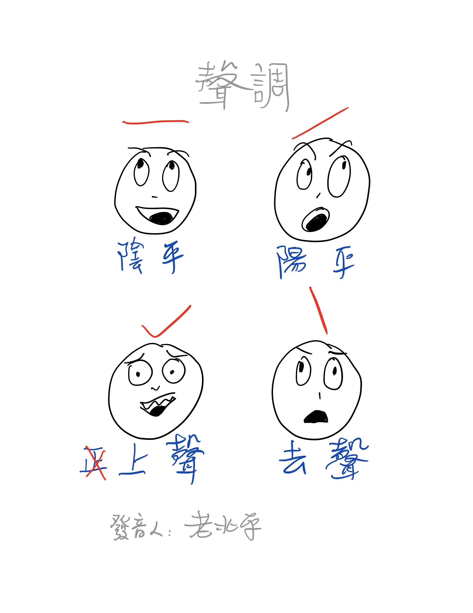
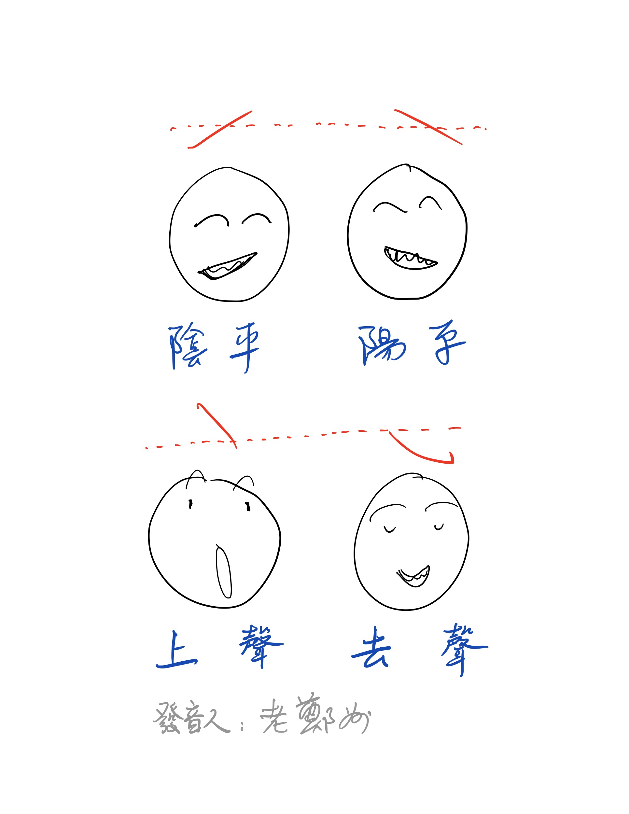

# 中原官話

配方： ℞ **lotem/rime-zhung**

[Rime](http://rime.im) 中原官話輸入方案

## 簡介

漢字讀音依照中原官話·鄭州老派口音，
收錄部分合音詞、兒化韻、子變韻及動詞變韻。

碼表採用【中州羅馬字】拼寫法。

鍵盤佈局可選用羅馬字、注音、增補漢語拼音、宮保拼音等。

## 安裝

[東風破](https://github.com/rime/plum) 安裝口令： `bash rime-install lotem/rime-zhung`

## 中州羅馬字拼寫法說明

### 聲母

|         |         |         |           |        |
|---------|---------|---------|-----------|--------|
| 不ㄅ b  | 普ㄆ p  | 木ㄇ m  | 夫ㄈ f    | 未ㄪ v |
| 大ㄉ d  | 他ㄊ t  | 那ㄋ n  | 辣ㄌ l    |        |
| 哥ㄍ g  | 可ㄎ k  | 河ㄏ h  | 鵝ㄫ (gh) |        |
| 及ㄐ j  | 欺ㄑ q  | 希ㄒ x  |           |        |
| 知ㄓ zh | 尺ㄔ ch | 十ㄕ sh | 日ㄖ rh   |        |
| 字ㄗ z  | 此ㄘ c  | 思ㄙ s  |           |        |

註：

* 疑母 \[ɣ\] 實際拼寫時不寫出（作零聲母處理）。
* 倘區分尖團音，\
  尖音拼作：即 zí 七 cí 西 sí 足 ziú 趨 ciú 需 siú ，\
  團音拼作：及 jí 欺 qí 希 xí 居 jú  區 qú  虛 xú 。
* 倘區分平翹舌，按實際發音拼寫，如：
  十四是十四〔鄭州〕shỳ sy̌ shy̌ shỳ sy̌ ，〔洛陽〕shỳ sy̌ sy̌ shỳ sy̌ 。

### 介音與韻母

|          |         |         |         |
|----------|---------|---------|---------|
| 十思 y   | 衣ㄧ i  | 屋ㄨ u  | 雨ㄩ iu |
| 兒ㄦ el  |         | 兒 (w)  | 書 (yu) |
|          |         |         |         |
| 啊ㄚ a   | 鴨 ia   | 蛙 ua   |         |
| 喔ㄛ o   | 藥 (io) | 我 uo   | 藥 iuo  |
| 鵝ㄜ eo  | 車 (ye) |         |         |
| 額ㄝ e   | 也 ie   | 國 ue   | 月 iue  |
|          |         |         |         |
| 哀ㄞ ai  | 界 iai  | 外 uai  |         |
| 北ㄟ ei  | (iei)   | 灰 ui   |         |
| 熬ㄠ au  | 要 iau  | (uau)   | (iuau)  |
| 歐ㄡ ou  | 有 iou  | (uou)   | (iuou)  |
|          |         |         |         |
| 安ㄢ an  | 煙 ian  | 彎 uan  | 冤 iuan |
| 恩ㄣ en  | 因 in   | 溫 un   | 雲 iun  |
| 昂ㄤ ang | 央 iang | 王 uang |         |
| 硬ㄥ eng | 英 ing  | 翁 ung  | 庸 iung |

註：

* 撮口介音 ㄩ 拼寫爲 iu 。
* 兒化韻標記爲 -l 。
* 採用 y 標記平翹舌音後的舌尖前/後元音，如：四 sy̌ 、十 shỳ 。
* 括弧中的韻母
  - 存在於在其他地方的中原官話音系，如〔洛陽〕兒 ẁ 、藥 yó ；
  - 某些中原官話方言中有圓脣舌尖元音 書 shyú 、以舌尖元音爲介音的 車 chyé ，
    皆以 -y 標記舌尖元音的特徵。
  - 僅出現在口語中，如感嘆詞 噫 yei ；
  - 如某些方言（包括本案）的子變韻音節：桌子 zhuáu 、筷子 quǎu 。
* 合口、撮口後鼻音拼作 ung, iung，如：中 zhúng 、龍 liùng 。

### 鄭州老派音系特點

* 區分尖團音，
  - 尖音：即 zí 七 cí 西 sí 足 ziú 趨 ciú 需 siú
  - 團音：及 jí 欺 qí 希 xí 居 jú  區 qú  虛 xú
* 區分平翹舌：
  - 則 zé  責 zhé
  - 塞 sé  色 shé
  - 鎖 suô 所 shuô
* 保存韻母 ㄜ eo 與 ㄝ e 、ㄨㄛ uo 與 ㄨㄝ ue 的對立：
  - 各 geó  革 gé
  - 郭 guó  國 gué
  - 奢 sheó 色 shé
* 保存韻母 ㄜ eo 與 ㄨㄛ uo 的對立：
  - 渴 keó 科 kuó
  - 合 heò 和 huò
* 保存韻母 ㄝ e 與 ㄨㄛ uo 的對立：
  - 伯 bé 博 buó
  - 迫 pé 潑 puó
* 保存韻母 ㄩㄛ iuo 與 ㄩㄝ iue 的對立：
  - 藥 yuó 月 yué
  - 角 juó 決 jué
  - 學 xuò 穴 xuè
  - 削 siuó 雪 siué
* 保存韻母 ㄨ u 與 ㄩ iu 的對立：
  - 族 zù 足 ziú
  - 速 sú 肅 siú
* 保存韻母 ㄨㄣ un 與 ㄩㄣ iun 的對立：
  - 榫 sûn 損 siûn
  - 輪 lùn 淪 liùn
* 保存韻母 ㄨㄥ ung 與 ㄩㄥ iung 的對立：
  - 鬆 súng 松 siúng
  - 叢 cùng 從 ciùng
  - 聾 lùng 龍 liùng
* 不排斥 i 或 u 同時出現在介音、韻尾位置，如 iai, iei, uau, uou 等韻母。

### 拼寫規則

* 介音 i, iu 的省略：在團音 j, q, x 後，iu 省略爲 u ；\
  若接韻母，介音 i 省略不寫，直接由聲母本身的腭化特徵展現。\
  例如：間 ján 、香 xáng 、茄 qè 、舉 jû 、缺 qué 、學 xuò 。
* 介音 i, u, iu 在零聲母音節開頭，改寫爲 y, w, yu ；\
  例如：我 wô 、也 yê 、要 yǎu 、有 yôu 、用 yǔng 。
* 自成音節的 i, u, iu 拼作 yi, wu, yu 。
* ui, un 一律不寫出中央元音，獨用時開頭加 w：位 wuǐ , 溫 wún 。
* 聲母 b, p, m 之後不省略合口介音 u，如：播 buó 、坡 puó 、末 muó 。
* 連寫有歧義時，用隔音符號 ' 隔開前後兩音節。

## 聲調與輸入說明

本方案採用與實際調形接近的符號輸入和標記聲調。

爲了提升打字效率，在鍵盤輸入時，上聲和去聲可選用不需要按 Shift 鍵的逗號與句點代替：

* **陰平**：記爲銳音符號 `á`，使用 `/` 輸入，例如 中 `zhung/`
* **陽平**：記爲鈍音符號 `à`，使用 `\` 輸入，例如 文 `wun\`
* **上聲**：標記爲揚抑號 `â`，使用 `<` 輸入，亦可用 `,` 代替，如 打 `da,`
* **去聲**：標記爲冄角號 `ǎ`，使用 `>` 輸入，亦可用 `.` 代替，如 字 `zy.`

輸入過程中，編碼會動態轉化爲相應的變音字母。

### 北平、鄭州聲調對比

## 增補漢語拼音

爲適用拼寫中原官話，擴充《漢語拼音方案》如下：

1. 增設普通話中缺失的聲母 v 和韻母 iai, uê, üo
2. 韻母 ê 在無介音時，爲避免與 e 混淆，鍵盤輸入 `ee`
2. 兼容尖音的拼寫，與舌尖元音混淆時韻母 i 拼作 -yi
  - 即 zyi
  - 七 cyi
  - 西 syi
3. 可能與尖音混淆時，舌尖元音可拼作強調形式 ï ，鍵盤輸入 `ii` 
4. ü 的技術替代形式，可選擇拼寫爲 ü（鍵盤輸入 `v`）或 -yu
  - 聚 zyu
  - 趣 cyu
  - 俗 syu
  - 女 nyu
  - 呂 lyu
5. 允許韻母 iou 以完整形式出現在拼式裏，以刻意與 yu 區別 
  - 就 ziou
  - 聚 zyu
  - 修 siou
  - 俗 syu
  - 牛 niou
  - 女 nyu
6. 爲避免混淆，不輸入聲調符號，需要說明聲調時用數字標調。

## 宮保拼音

中原官話版與普通話版相比，做以下修訂：

格式：中州羅馬字 = 宮保拼音碼

* v = ZFB     用於 未 = ZFBI
* gh = SHG    僅用於 啊 = SHGA
* eo = O
* iuo = IO
* e = E
* ue = UE
* iai = IAR
* iou = IR    不拼作 IRO
* iung = ÜNE  可活用爲 IRO

以下並擊指法不變，因中州羅馬字記法不同重新闡述：

* rh = HG
* iu = Ü
* iue = ÜE
* el = R
* ui = UR
* au = AO
* iau = IAO
* iuan = ÜAN
* un = UN
* iun = ÜN
* ung = URO
